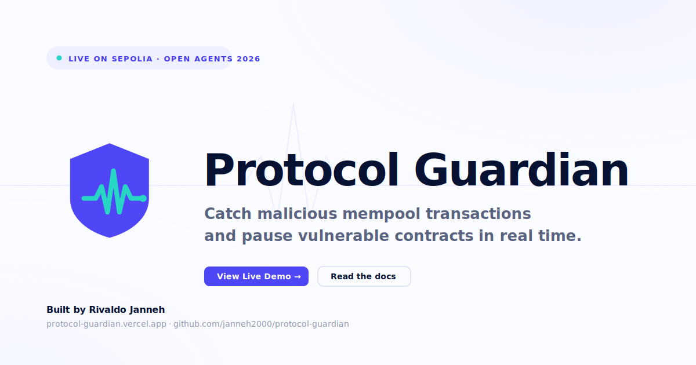

# Protocol Guardian Agent



> Autonomous AI sentinel for DeFi protocol security. Watches the Ethereum mempool in real time, classifies threats with Claude, consults paid threat-intel through a KeeperHub agentic wallet, broadcasts threat fingerprints to a peer-to-peer swarm of Guardians over Gensyn AXL, and autonomously calls `pause()` on vulnerable contracts before exploits complete.

Built for **ETHGlobal Open Agents 2026**. Live on Sepolia.

- 🔗 Live demo · <https://protocol-guardian.vercel.app/dashboard>
- 🌐 Marketing site · <https://protocol-guardian.vercel.app/>
- 👤 Founder · [Rivaldo Janneh](https://github.com/janneh2000)

---

## Note for ETHGlobal judges — repo timeline

This repo's first commit pre-dates the official Open Agents hacking window (kickoff: April 24, 2026). Here's why and what to look at:

**Why the early commits exist.** I created this repository the day Open Agents was announced and used it as a personal research/brainstorming workspace for ~26 days before kickoff. Every commit dated **March 29 – April 6** is scaffolding: the base Solidity contracts, the agent loop skeleton, the mempool ingestion plumbing, the RAG dataset, and the dashboard shell. None of those commits implement a prize-aligned feature.

**Where the hackathon-eligible work lives.** Every commit dated **April 24, 2026 or later** is hackathon-window work. That's where all three partner integrations, the entire public-facing surface, and the brand system were built:

| Commit | Date | What's in it |
|---|---|---|
| [`ba96505`](../../commit/ba96505) | Apr 28 | KeeperHub paid-intel escalation via `@keeperhub/wallet` |
| [`35523b9`](../../commit/35523b9) | Apr 28 | ENS live resolution + Sepolia registration helper |
| [`512ee6b`](../../commit/512ee6b) | Apr 28 | Gensyn AXL Guardian swarm — P2P fingerprint mesh |
| [`296ca95`](../../commit/296ca95) | Apr 28 | Logo system + 1200×630 cover image |
| [`86f2302`](../../commit/86f2302) | Apr 28 | `/get-started` page (wallet connect + email + how-it-works) |
| [`7168322`](../../commit/7168322) | Apr 27 | Marketing site — landing, login, team, light + dark themes |
| [`26f44cc`](../../commit/26f44cc) | Apr 28 | Hero illustration — concrete mempool → classifier → on-chain action |
| [`a4d2563`](../../commit/a4d2563) | Apr 29 | This README |

**Verifying.** Run `git log --since="2026-04-24" --pretty=format:"%h %ad %s" --date=short` from a clone of this repo to see the full hackathon-window commit list. The prize-form "link to code where the tech is used" fields point at line numbers inside the post-April-24 commits.

I'd rather flag this upfront than have it surface as a question during review.

---

## What it does

| Layer | What happens |
|---|---|
| **Ingestion** | Subscribes to Ethereum mempool + blocks via Alchemy WebSocket |
| **Heuristics** | Fast pattern screening: flash loans, oracle deviations, TVL drains, reentrancy, access-control, governance |
| **AI Reasoning** | Claude classifies the attack type, scores confidence 0–100, decides action |
| **Paid Intel** *(KeeperHub)* | In the ALERT confidence band (40–74), consults x402-gated threat feeds via `@keeperhub/wallet`'s `paymentSigner`. The Turnkey-custodied wallet auto-pays the 402, gated by KeeperHub's PreToolUse safety hook |
| **Swarm Sync** *(Gensyn AXL)* | High-confidence detections broadcast a 73-byte threat fingerprint over a local AXL node's `/send` endpoint. Peer Guardians read `/recv` and raise their confidence floor for matching txs |
| **Action** | Calls `emergencyPause()` on the Guardian contract if confidence ≥ 75% |
| **Identity** *(ENS)* | The agent operates as `protocol-guardian.eth` on Sepolia. The dashboard reverse-resolves agent + protocol addresses to ENS names live via viem |
| **Report** | Claude generates a full post-incident security report |
| **Dashboard** | Live operator dashboard with events, confidence scores, and reports |
| **Marketing surface** | Landing, login, team, and get-started pages with light/dark themes, EIP-6963 wallet connect, and an ENS-aware footer |

---

## Architecture

```
                                        ┌───────────────────────────┐
   Ethereum Mempool / Blocks            │   Peer Guardian (AXL)     │
            │                           │   peer Guardian (AXL)     │
            ▼                           └─────────▲─────────────────┘
   BlockchainIngestion                            │ /send /recv (P2P)
            │                                     │
            ▼                                     │
    HeuristicsEngine                       ┌──────┴──────┐
            │  (risk_score ≥ 30 → escalate)│   AXL Node  │
            ▼                              │  (gensyn-ai)│
        AIAgent          ─────► confidence └─────────────┘
            │            40-74?                  ▲
            │                  │                 │ broadcast on PAUSE
            │                  ▼                 │
            │           KeeperHub bridge ────────┤
            │           (@keeperhub/wallet —     │
            │            x402 paid intel)        │
            │                  │                 │
            ▼                  │                 │
       ┌────┴────┐             │                 │
       │         │◄────────────┘                 │
     PAUSE     ALERT                             │
       │                                         │
       ▼                                         │
  GuardianController.sol  ──── emergencyPause() ─┘
       │
       ▼
   ReportGenerator             ← Claude post-incident markdown
       │
       ▼
   Dashboard (live HTML)       ← ENS-resolved identity, events, reports
```

---

## Public surface

The repo ships a four-page marketing site plus the operator dashboard. Marketing pages share one design system (Inter, blue/mint palette, 9px button radius, 1510px max width, light + dark mode); the dashboard keeps its dark/technical look.

| Path | What it is |
|---|---|
| `/` (`index.html`) | Landing — hero illustration of mempool → classifier → on-chain pause flow, what-it-monitors, how-it-works, stats, waitlist |
| `/get-started` (`get-started.html`) | Onboarding — Connect Wallet (MetaMask + Coinbase via EIP-6963 with ENS reverse-resolve on connect), email waitlist, four-step visual guide |
| `/login` (`login.html`) | Log-in form, value-prop split layout |
| `/team` (`team.html`) | Solo-founder team page — bio, stack ownership, contact links |
| `/dashboard/` (`dashboard/index.html`) | Live operator dashboard (dark) |

Theme management lives in `theme.js` — synchronous, head-loaded, FOUC-safe; reads `localStorage('protoguardian-theme')`, falls back to `prefers-color-scheme`, exposes `window.ProtoGuardianTheme.{get,set,clear}`.

Brand assets in `assets/`:

- `logo.svg`, `logo-dark.svg`, `logo-mono.svg` — primary mark in light/dark/currentColor variants
- `logo-lockup.svg` — horizontal mark + Protocol Guardian wordmark
- `cover.svg` — 1200×630 OG / Twitter / GitHub social card

---

## Partner integrations (ETHGlobal Open Agents 2026)

### KeeperHub — paid threat-intel escalation

`agent/keeperhub_intel.mjs` calls `paymentSigner.fetch()` from [`@keeperhub/wallet`](https://github.com/keeperhub/agentic-wallet-skills) against an x402-gated threat-intel endpoint. The wallet auto-pays the 402 challenge with Turnkey-custodied USDC; the PreToolUse safety hook gates anything over the auto-approve floor. Triggered from `agent/ai_agent.py` whenever Claude lands in the ALERT confidence band (40–74).

```python
# agent/ai_agent.py — confidence 40–74 escalation
intel = await fetch_paid_intel(selector, target)
if intel.get("ok"):
    decision = reconcile_with_intel(decision, intel)
```

Setup is one shot:

```bash
npx @keeperhub/wallet skill install   # provisions Turnkey custody + safety hook
```

### ENS — agent identity + dashboard resolution

`dashboard/ens.js` uses viem to reverse-resolve every address in the dashboard at render time (Sepolia first, mainnet fallback for canonical protocol names). The agent itself runs under `protocol-guardian.eth` with text records for description, GitHub, and project URL.

Register the agent's name on Sepolia in one command:

```bash
node scripts/register_ens.mjs full
```

See `scripts/REGISTER_ENS.md` for the step-by-step.

### Gensyn AXL — Guardian swarm

Each Guardian instance runs its own [`gensyn-ai/axl`](https://github.com/gensyn-ai/axl) node. High-confidence detections broadcast a 73-byte threat fingerprint over the local AXL HTTP bridge's `/send` endpoint; peer Guardians poll `/recv` and apply incoming fingerprints to amplify their classifier confidence on matching txs. No centralized broker.

Three-node demo via the bundled compose stack:

```bash
docker compose -f agent/axl/docker-compose.yml up --build
```

That brings up `axl-public` (rendezvous, host `:9001` + bridge `:9090`), `axl-alice` (bridge `:9091`), `axl-bob` (bridge `:9092`). Smoke test in `agent/axl/README.md`.

---

## Prerequisites

- Python 3.11+
- Node.js 20+ (KeeperHub wallet requires Node 20)
- Docker (for the AXL swarm demo only)
- Git
- A funded Sepolia wallet (~0.1 ETH — get from [sepoliafaucet.com](https://sepoliafaucet.com/))
- Alchemy account (free) — [dashboard.alchemy.com](https://dashboard.alchemy.com)
- Anthropic API key — [console.anthropic.com](https://console.anthropic.com)

---

## Step-by-step setup

### Step 0 — Quick verify (30 seconds, no API keys needed)

If you just want to confirm the repo is sound — every page parses, every
script syntax-checks, every integration is wired — run the no-secrets
smoke test. No `.env`, no funded wallet, no Docker, no API keys
required:

```bash
git clone https://github.com/janneh2000/protocol-guardian.git
cd protocol-guardian
npm install
python3 -m pip install -r requirements.txt
make verify       # or: npm run verify
```

You should see `18/18 passed`. This validates every HTML page, every
Python module, every Node script, every SVG asset, every JSON config,
and that the AXL fingerprint round-trips bit-exact, the KeeperHub
bridge degrades gracefully when no wallet is provisioned, and all four
integration hooks are wired into `agent/ai_agent.py::analyse()`.

For full runtime verification (Sepolia, Claude classifier, AXL swarm,
KeeperHub x402, ENS registration), continue through Steps 1–11 below.

### Step 1 — Clone the repo

```bash
git clone https://github.com/janneh2000/protocol-guardian.git
cd protocol-guardian
```

### Step 2 — Install Node dependencies

```bash
npm install
```

Installs Hardhat, OpenZeppelin contracts, deploy tooling, and the KeeperHub agentic wallet (`@keeperhub/wallet`).

### Step 3 — Install Python dependencies

```bash
python3 -m venv venv
source venv/bin/activate        # Windows: venv\Scripts\activate
pip install -r requirements.txt
```

### Step 4 — Configure environment variables

```bash
cp .env.example .env
```

Open `.env` and fill in every value:

```env
# Alchemy — create an app at dashboard.alchemy.com, select Sepolia
ALCHEMY_WS_RPC=wss://eth-sepolia.g.alchemy.com/v2/YOUR_KEY
ALCHEMY_HTTP_RPC=https://eth-sepolia.g.alchemy.com/v2/YOUR_KEY
SEPOLIA_RPC_URL=https://eth-sepolia.g.alchemy.com/v2/YOUR_KEY

# Anthropic
ANTHROPIC_API_KEY=sk-ant-...

# Sepolia wallet (needs ~0.1 ETH for deploys + ENS registration)
DEPLOYER_PRIVATE_KEY=0x...
GUARDIAN_HOT_WALLET_PRIVATE_KEY=0x...
# python scripts/get_address.py 0xYOUR_PRIVATE_KEY
GUARDIAN_HOT_WALLET=0x...
ATTACKER_PRIVATE_KEY=0x...

# Filled after Step 5
LENDING_POOL_ADDRESS=
GUARDIAN_CONTRACT_ADDRESS=

# ENS registration (Step 6) — same key as DEPLOYER is fine for the demo
GUARDIAN_AGENT_KEY=0x...
GUARDIAN_ENS_NAME=protocol-guardian
GUARDIAN_ENS_DESC=Autonomous DeFi security agent — pauses vulnerable contracts in real time.
GUARDIAN_ENS_GITHUB=janneh2000
GUARDIAN_ENS_URL=https://protocol-guardian.vercel.app

# AXL swarm (Step 8) — defaults work for the docker-compose demo
AXL_BASE_URL=http://localhost:9090
AXL_TOPIC=pg-threats
```

> **Security note**: Never commit `.env`. It's in `.gitignore`.

### Step 5 — Compile and deploy contracts

```bash
npx hardhat compile
npx hardhat run scripts/deploy.js --network sepolia
```

Copy the two addresses into your `.env`:

```env
LENDING_POOL_ADDRESS=0xAAA...
GUARDIAN_CONTRACT_ADDRESS=0xBBB...
```

### Step 6 — (Optional) Register the agent's ENS name

```bash
node scripts/register_ens.mjs check     # availability + price
node scripts/register_ens.mjs full      # commit, wait 65s, register, set records
```

After registration the dashboard footer auto-upgrades from `0x2344…12fE` to `protocol-guardian.eth` on the next page load. Full guide: `scripts/REGISTER_ENS.md`.

### Step 7 — (Optional) Provision the KeeperHub wallet

```bash
npx @keeperhub/wallet skill install
```

This provisions the Turnkey sub-org wallet and registers the PreToolUse safety hook. The agent will use it whenever Claude lands in the ALERT confidence band.

### Step 8 — (Optional) Spin up the AXL swarm

```bash
docker compose -f agent/axl/docker-compose.yml up --build
```

Three AXL nodes peer over TLS. The agent's `broadcast_threat()` and `recv_peer_threats()` automatically use the local bridge at `AXL_BASE_URL` (default `http://localhost:9090`).

### Step 9 — Start the guardian agent

Open **Terminal 1**:

```bash
source venv/bin/activate
python main.py
```

You should see:
```
╔══════════════════════════════════════════════════╗
║     Protocol Guardian Agent — Starting Up        ║
╠══════════════════════════════════════════════════╣
║  Ingestion  → WebSocket mempool + block stream   ║
║  Heuristics → Flash loan, drain, oracle checks   ║
║  AI Layer   → Claude threat classification       ║
║  Paid Intel → @keeperhub/wallet (x402 escalation)║
║  Swarm      → AXL peer broadcast / receive       ║
║  Action     → Onchain emergencyPause()           ║
║  Reports    → Auto-generated incident reports    ║
╚══════════════════════════════════════════════════╝
```

### Step 10 — Open the dashboard

```bash
cd dashboard && python3 -m http.server 8080
# Open: http://localhost:8080
```

Or visit the deployed dashboard at <https://protocol-guardian.vercel.app/dashboard>.

### Step 11 — Run the attack simulator (DEMO)

Open **Terminal 2**:

```bash
source venv/bin/activate
python scripts/attack_simulator.py
```

Watch **Terminal 1** respond:

```
INFO  guardian.ingestion — Interesting pending tx: 0xabc123... | flash_loan=True
INFO  guardian.heuristics — Risk: 65/100 (oracle_price_manipulation, flash_loan_detected)
INFO  guardian.ai_agent — Decision: PAUSE | flash_loan_price_manipulation | confidence=91%
INFO  guardian.axl — Broadcast threat fingerprint to swarm: selector=0x... target=0x... confidence=91
CRITICAL guardian.action — PAUSING PROTOCOL — flash_loan_price_manipulation | confidence=91%
CRITICAL guardian.action — Pause tx submitted: 0xdef456...
CRITICAL guardian.action — PROTOCOL PAUSED SUCCESSFULLY. Block: 7234567

POST-INCIDENT REPORT
════════════════════
Title:     Flash Loan Oracle Manipulation — MockLendingPool
Severity:  Critical
Protected: $42,000
Signed by: protocol-guardian.eth
```

In Terminal 2:
```
[ATTACKER] Borrow FAILED: Protocol is PAUSED!
[GUARDIAN] Attack neutralised successfully.
```

---

## Simulate mode (no real transactions)

```bash
python main.py --simulate
```

Runs the full pipeline (ingestion → heuristics → AI → KeeperHub intel → AXL broadcast → decision) but skips the on-chain `pause()` call. Use this to verify everything is wired before funding the hot wallet.

---

## Project structure

```
protocol-guardian/
├── contracts/
│   ├── MockLendingPool.sol           # Demo target protocol
│   └── ProtocolGuardian.sol          # Guardian controller (PAUSER_ROLE)
├── scripts/
│   ├── deploy.js                     # Hardhat deploy
│   ├── attack_simulator.py           # Demo attack
│   ├── get_address.py                # Address from private key
│   ├── register_ens.mjs              # Sepolia ENS registration (commit/reveal)
│   └── REGISTER_ENS.md               # ENS registration guide
├── agent/
│   ├── main.py                       # Entry point, orchestrator
│   ├── ingestion.py                  # WebSocket mempool + block subscription
│   ├── heuristics.py                 # Fast pattern screening
│   ├── ai_agent.py                   # Claude reasoning + KeeperHub + AXL hooks
│   ├── exploit_rag.py                # Historical exploit RAG
│   ├── action.py                     # Onchain execution + alerts
│   ├── report.py                     # Post-incident report generator
│   ├── keeperhub_intel.mjs           # Node entrypoint — paymentSigner.fetch()
│   ├── keeperhub_bridge.py           # Python ↔ Node bridge for KeeperHub
│   └── axl/
│       ├── swarm_client.py           # AXL HTTP-bridge client + ThreatFingerprint
│       ├── node-config.public.json   # Listening rendezvous AXL node config
│       ├── node-config.peer.json     # Peer Guardian AXL node config
│       ├── Dockerfile                # Builds gensyn-ai/axl from source
│       ├── entrypoint.sh             # Generates ed25519 key + boots node
│       ├── docker-compose.yml        # 3-node demo stack
│       └── README.md                 # AXL run instructions
├── dashboard/
│   ├── index.html                    # Live operator dashboard
│   ├── ens.js                        # viem-based ENS resolver
│   └── protocol-guardian-dashboard.jsx
├── assets/
│   ├── logo.svg                      # Primary mark (light bg)
│   ├── logo-dark.svg                 # White-shield variant (dark bg)
│   ├── logo-mono.svg                 # currentColor variant
│   ├── logo-lockup.svg               # Horizontal mark + wordmark
│   └── cover.svg                     # 1200×630 OG card
├── index.html                        # Landing
├── login.html                        # Log-in page
├── team.html                         # Founder team page
├── get-started.html                  # Onboarding (wallet connect + email)
├── theme.js                          # FOUC-safe theme manager
├── vercel.json                       # Vercel routing config
├── .env.example                      # Environment template
├── requirements.txt                  # Python deps
├── package.json                      # Node deps (Hardhat + @keeperhub/wallet + viem)
└── hardhat.config.js                 # Hardhat config
```

---

## How the AI reasoning works

The AI layer receives a structured prompt containing:

1. **Transaction data** — hash, from/to, value, input selector
2. **Pool state** — liquidity before/after, oracle price before/after
3. **Heuristics signals** — pre-screened risk factors with severity scores
4. **RAG context** — 3 most similar historical exploits from DeFiHackLabs database
5. **Peer signals** — any matching threat fingerprints recently received from AXL peers

Claude returns structured JSON:

```json
{
  "attack_type": "flash_loan_price_manipulation",
  "confidence": 91,
  "action": "PAUSE",
  "suspected_attacker": "0xAttackerAddress",
  "estimated_loss_usd": 42000,
  "rationale": "Transaction exhibits classic flash loan oracle manipulation pattern. Attacker borrowed large ETH position, immediately updated oracle price by 50%, then attempted to borrow against artificially deflated collateral. Pattern matches Mango Markets exploit (Oct 2022, $116M)."
}
```

Confidence-band routing:

- **PAUSE** (≥ 75) → broadcast fingerprint to AXL swarm + call `emergencyPause()` on-chain
- **ALERT** (40–74) → escalate to KeeperHub-paid threat intel; possibly upgrade to PAUSE or downgrade to IGNORE
- **IGNORE** (< 40) → log and move on

The 75 threshold is also enforced **on-chain** in `ProtocolGuardian.sol` — a compromised guardian key cannot pause with confidence < 75.

---

## What makes this different from Forta + OZ Defender

| Feature | Forta + Defender | Protocol Guardian |
|---|---|---|
| Detection method | Hardcoded rules | AI reasoning with context |
| Novel attack vectors | Misses them | Can reason about new patterns |
| Rationale | None | Plain-English explanation |
| Post-incident report | Manual | Auto-generated by Claude |
| RAG on past exploits | No | Yes — DeFiHackLabs dataset |
| Confidence scoring | Binary | 0–100 with on-chain threshold enforcement |
| Paid threat-intel | No | Yes — KeeperHub agentic wallet |
| Peer-to-peer swarm | No | Yes — Gensyn AXL mesh |
| Agent identity | None | ENS (`protocol-guardian.eth`) |

---

## Sepolia testnet links

- Sepolia Etherscan: [sepolia.etherscan.io](https://sepolia.etherscan.io)
- Sepolia faucet: [sepoliafaucet.com](https://sepoliafaucet.com)
- Alchemy dashboard: [dashboard.alchemy.com](https://dashboard.alchemy.com)
- ENS on Sepolia: [app.ens.domains](https://app.ens.domains/) (network selector → Sepolia)

---

## Built with

- [Anthropic Claude](https://anthropic.com) — AI threat reasoning
- [@keeperhub/wallet](https://github.com/keeperhub/agentic-wallet-skills) — agentic wallet for x402 paid threat-intel
- [gensyn-ai/axl](https://github.com/gensyn-ai/axl) — P2P swarm communication layer
- [ENS](https://ens.domains) + [viem](https://viem.sh) — agent identity + dashboard resolution
- [web3.py](https://web3py.readthedocs.io) — Ethereum interaction
- [Hardhat](https://hardhat.org) — Contract compilation and deployment
- [OpenZeppelin](https://openzeppelin.com) — Pausable + AccessControl base contracts
- [Alchemy](https://alchemy.com) — WebSocket mempool subscriptions
- [DeFiHackLabs](https://github.com/SunWeb3Sec/DeFiHackLabs) — Historical exploit dataset

---

## Roadmap

- Pilot cohort: 3–5 DeFi protocols on Sepolia, then a single mainnet pilot
- Multi-chain: Base, Arbitrum, Optimism, Polygon
- Swarm scale: dozens of Guardians peering over AXL, each watching a different protocol family
- Open-source the threat heuristics + Guardian contract framework as public-good infrastructure

Interested in piloting? Email [`cjanneh@gmail.com`](mailto:cjanneh@gmail.com).

---

## Credits

© 2026 Protocol Guardian · Built and led by [Rivaldo Janneh](https://github.com/janneh2000).

Acknowledgments — built on the shoulders of the broader Ethereum developer community whose patterns and tooling make a project like this possible.

---

## License

MIT
